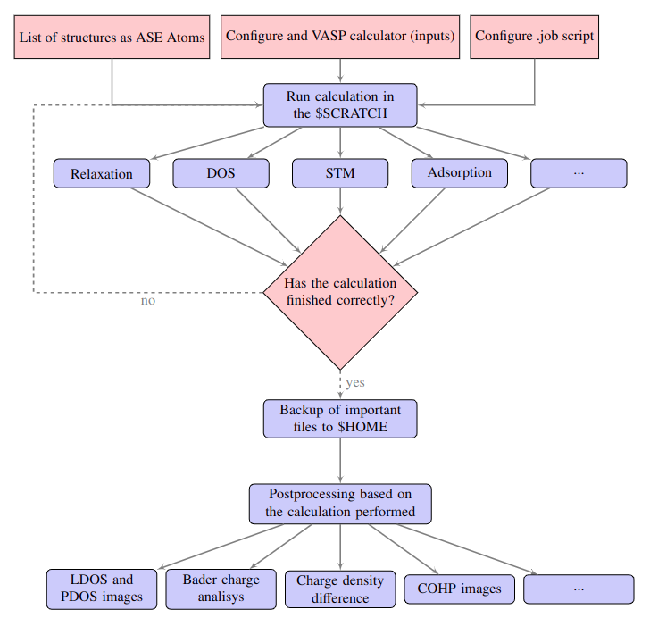

Welcome to Vulcan's documentation!
===================================

**Vulcan** is a Python code to make life easier when working with VASP. It optimized all steps in the calculation process, from creating the structure to be studied to making a backup of the results on a SQL database. It was developed to work exclusively on VASP (for now) and in a remote supercomputer cluster with a queue system, and makes heavy use of the Atomic Simulation Environment (ASE).

   Flowchart of the Vulcan code.

.. note::

   This project is under active development.

Contents
--------

.. toctree::

   usage
   configuration
   useful_scripts
   calculations
